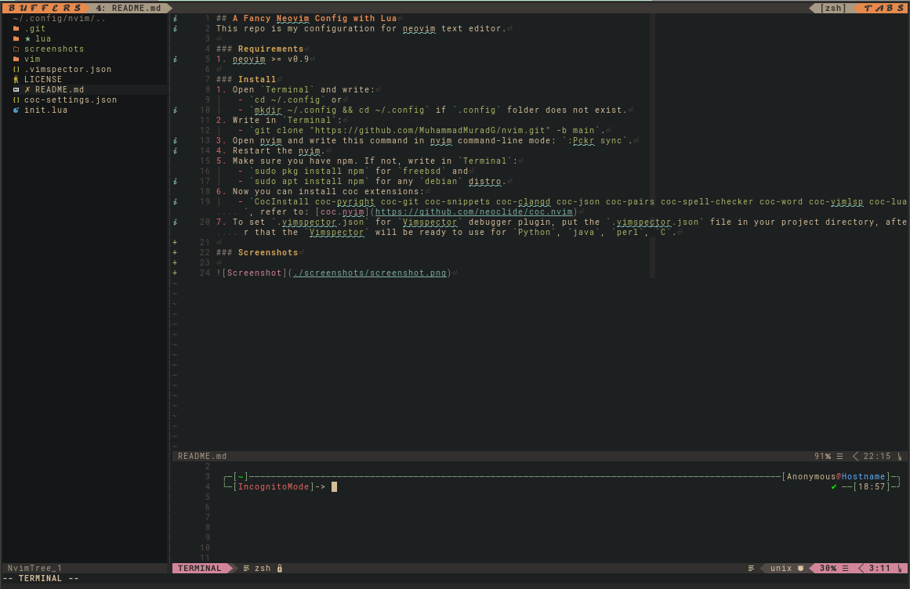

## A Fancy Neovim Config with Lua
This repo is my configuration for neovim text editor.

### Requirements
1. neovim >= v0.9

### Install
1. Open `Terminal` and write:
	- `cd ~/.config` or
	- `mkdir ~/.config && cd ~/.config` if `.config` folder does not exist.
2. Write in `Terminal`:
	- `git clone "https://github.com/MuhammadMuradG/nvim.git" -b main`.
3. Open nvim and write this command in nvim command-line mode: `:Pckr sync`.
4. Restart the nvim.
5. Make sure you have npm. If not, write in `Terminal`:
	- `sudo pkg install npm` for `freebsd` and
	- `sudo apt install npm` for any `debian` distro.
6. Now you can install coc extensions:
	- `CocInstall coc-pyright coc-git coc-snippets coc-clangd coc-json coc-pairs coc-spell-checker coc-word coc-vimlsp coc-lua`, refer to: [coc.nvim](https://github.com/neoclide/coc.nvim)
7. To set `.vimspector.json` for `Vimspector` debugger plugin, put the `.vimspector.json` file in your project directory, after that the `Vimspector` will be ready to use for `Python`, `java`, `perl`, `C`.

### Screenshots

